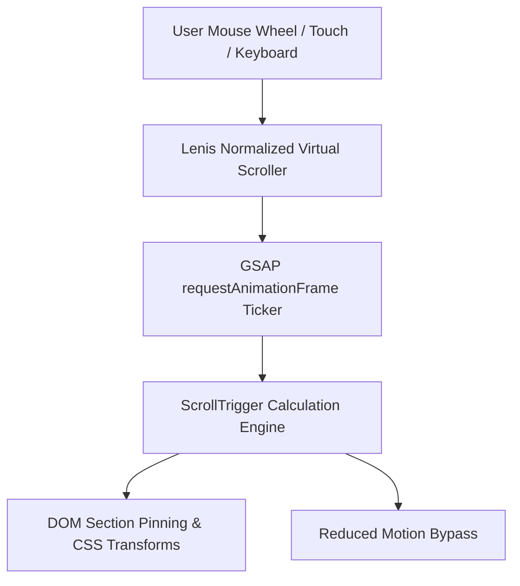

# ADR-001: Selection of Lenis & GSAP ScrollTrigger Motion Stack

**Status:** Accepted  
**Date:** 2026-08-17  
**Context:** CAn Client Next-Gen Beverage Experience  
**Authors:** Lead Frontend Architecture Team  

---

## 1. Context and Problem Statement

The CAn digital experience requires a high-impact, kinetic single-page layout featuring:
1. Pinned interactive storytelling across 4 sequential benefit claim-swaps.
2. Synchronized background visual scrubbing linked to scroll velocity.
3. Smooth, momentum-based scrolling with fluid anchor jumping.
4. Absolute compliance with Core Web Vitals (sub-2.5s LCP, zero CLS, sub-150ms INP) and WCAG 2.1 AA motion safety.

We evaluated two architectural paths:
- **Option A:** Native CSS `scroll-snap-type: y mandatory` + IntersectionObserver.
- **Option B:** `@studio-freight/lenis` (Lenis) smooth scrolling synchronized with `gsap` + `ScrollTrigger` via requestAnimationFrame ticker.

---

## 2. Decision & Architecture

We have chosen **Option B: Lenis + GSAP ScrollTrigger**.

All motion orchestration is encapsulated within a client-only `<MotionProvider>` component placed at the root level of the application.

---

## 3. Rationale & Tradeoff Analysis

### 3.1 Why Native CSS Scroll-Snap Was Rejected
- **Scroll-Jacking Inconsistencies:** CSS scroll-snap introduces rigid browser-level wheel interception that varies wildly between macOS trackpads, Windows notched mouse wheels, and mobile touchscreens.
- **Lack of Timeline Synchronization:** CSS scroll-snap cannot smoothly scrub numeric counters, synchronized SVG vector paths, or progressive video playback frames in direct proportion to scroll pixels.
- **Pinned State Jump Glitches:** Complex multi-step narrative pins (e.g. Benefits 1 through 4) suffer from layout jitter and jump artifacts during bidirectional scrolling with pure CSS sticky/snap.

### 3.2 Benefits of Lenis + GSAP ScrollTrigger
1. **Hardware-Accelerated Interpolation:** Lenis normalizes input deltas across all input devices without disabling native accessibility or browser scrollbars.
2. **Deterministic Timeline Scrubbing:** GSAP ScrollTrigger calculates exact scroll start/end offsets and allows continuous interpolation (`scrub: 1`).
3. **Single RAF Ticker:** Coupling Lenis to `gsap.ticker` ensures there is exactly **one** global animation loop, reducing CPU overhead and preventing frame-pacing micro-stutters.
4. **Instant Accessibility Grace:** When `@media (prefers-reduced-motion: reduce)` is detected, the entire Lenis smooth inertia layer is bypassed, providing instant, jump-free native scroll for sensitive users.

---

## 4. Mitigation of Next.js App Router Pitfalls

| Potential Risk | Architectural Mitigation |
| :--- | :--- |
| **SSR / Hydration Mismatches** | All GSAP plugin registrations and Lenis constructors are gated inside `useEffect` within client-only components (`'use client'`). No `window` or `document` access occurs during SSR. |
| **ScrollTrigger Memory Leaks** | On component unmount or route change, `<MotionProvider>` and individual section hooks execute `ScrollTrigger.getAll().forEach(t => t.kill())` to eliminate orphaned scroll event listeners. |
| **Performance Overhead** | `gsap.ticker.lagSmoothing(0)` is configured to prevent large jump-ahead animations after background tab throttling. |

---

## 5. Consequences & Compliance

- **Bundle Budget Impact:** Adds ~38KB (gzipped) combined. Our baseline bundle remains ~117KB total First Load JS, comfortably below the 165KB threshold.
- **Maintenance:** Future engineers must use `gsap.context()` or `useMotion()` hook rather than instantiating independent ScrollTrigger instances.
