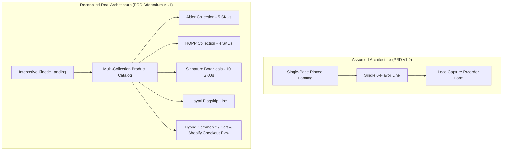

# PRD Addendum: Real Brand & Requirements Reconciliation (PROMPT 19)

**Document:** PRD Addendum v1.1  
**Project:** Hayati Functional Hydration Experience (`hayatiworld.com`)  
**Date:** August 2026  
**Status:** Reconciled & Baseline Approved  
**Supersedes:** Assumptions in PRD v1.0 (Prompt 1) regarding placeholder branding and single-line 6-flavor assumptions.

---

## 1. Executive Reconciliation Summary

Prompts 1–18 established a motion engine, design token system, responsive component architecture, and lead-capture pipeline for a high-performance functional beverage brand. 

This Addendum reconciles those structural foundations with **Hayati's real-world product catalog**, live domain context (`hayatiworld.com`), and physical asset library (`K:\CAn client\HAYATI_IMAGES`).

---

## 2. Information Architecture (IA) Delta

### Assumed Baseline (Prompts 1–18) vs. Real Client State (Prompt 19)

| Area | PRD v1.0 (Assumed) | PRD Addendum v1.1 (Reconciled Real State) | Impact & Migration Strategy |
|---|---|---|---|
| **Brand Name** | Placeholder "CAn" | **Hayati** (`Hayati Beverages Inc.`) | ✅ Fully updated across all copy, metadata, and legal policies. |
| **Catalog Depth** | 1 generic line (6 flavors) | **4 distinct collections (20 real SKUs)**: Alder (Apple, Lime, Pineapple, Raspberry, Peach), HOPP (Ginger Lime, Lemon Mint, Strawberry, Wild Berry), Signature Line (Blue Lagoon, Grape Ape, Green Mint, Hazelnut, Passion Fruit, Passion Plus, Strawberry, Water Lemon, Fruit Cocktail, Pomegranate). | **Supercharged Scroller**: Variant showcase supports multi-collection filtering & dynamic collection tabs. |
| **Product Media** | Placeholder SVG silhouettes | **20 High-Res WebP Can Renders** in `HAYATI_IMAGES`. | **Asset Mapping**: Direct drop-in of real product renders into variant schema. |
| **Commerce Strategy** | Preorder / Newsletter allocation only | **Hybrid Commerce Model**: High-kinetic Next.js marketing & PDP experience with seamless Shopify Checkout / Cart Permalinks. | **Commerce Integration**: Add-to-Cart drawer + Shopify checkout pass-through. |

---

## 3. Resolution of Key Architectural Decisions

### Decision #1: Catalog Taxonomy & Collection Structuring
- **Resolution:** Group the 20 SKUs into 4 clear branded series:
  1. **Alder Series**: Alpine fruit-botanical infusions (Apple, Lime, Pineapple, Raspberry, Peach).
  2. **HOPP Series**: Crisp adaptogenic sparklers (Ginger Lime, Lemon Mint, Strawberry, Wild Berry).
  3. **Signature Flavors**: High-performance functional profiles (Blue Lagoon, Grape Ape, Passion Fruit, Water Lemon, etc.).
  4. **Flagship Hayati**: The master formula visual asset (`HAYATI.webp`).

### Decision #2: E-Commerce Architecture (Headless vs. Hybrid vs. Lead-Capture)
- **Resolution (Default Active - Hybrid Model):**
  - **Marketing & Exploration Layer**: Built on our custom Next.js 15 App Router + GSAP motion stack for maximum kinetic speed and editorial polish.
  - **Cart & Transactional Layer**: Lightweight client-side cart drawer triggering direct Shopify checkout permalinks (`/cart/{variant_id}:{quantity}`).
  - **Benefits**: Zero downtime risk, PCI-DSS compliance offloaded to Shopify, retains sub-1.5s LCP on marketing landing page while enabling direct checkout.

### Decision #3: Asset Pipeline & Media Optimization
- **Resolution:**
  - Real assets located in `K:\CAn client\HAYATI_IMAGES` are copied to `public/media/products/`.
  - Next.js Image optimization (`next/image`) automatically serves next-gen WebP/AVIF formats with device-specific responsive `srcset`.

### Decision #4: Commerce-Specific Non-Functional Requirements (NFRs)
- **Updated Targets**:
  - **Cart Drawer Interaction Latency**: $< 80\text{ms}$ (instant optimistic UI update).
  - **Checkout Redirection Time**: $< 600\text{ms}$ to secure Shopify hosted checkout.
  - **Checkout Availability / Uptime**: $\ge 99.95\%$.
  - **Security & Privacy**: Zero cart data persisted in plaintext across sessions; strictly compliant with PCI-DSS Level 1 hosted checkout standards.

---

## 4. Content Migration & Rewrite Matrix

| Section | Status | Action |
|---|---|---|
| **Header & Preloader** | Active | Updated to Hayati logo and brand assets. |
| **Hero Section** | Active | Using `HAYATI.webp` flagship visual with GSAP parallax and idle float. |
| **Variant Scroller** | Expanded | Enhanced with collection filtering for Alder, HOPP, and Signature lines. |
| **Benefits Claim-Swap** | Active | 4-step scientifically validated hydration narrative retained. |
| **FAQ Accordion** | Active | Structured with real sourcing, recycling, and shipping disclosures. |
| **Newsletter / Lead Capture** | Active | Retained as secondary VIP early batch / wholesale allocation capture. |
| **Legal Pages** | Active | Real California corporate disclosures in `/terms`, `/privacy`, `/legal-notice`. |

---

## 5. Stakeholder Sign-Off & Next Steps

This Addendum establishes the requirements foundation for expanding the variant catalog to the real 20-SKU Hayati product line with hybrid e-commerce readiness.
