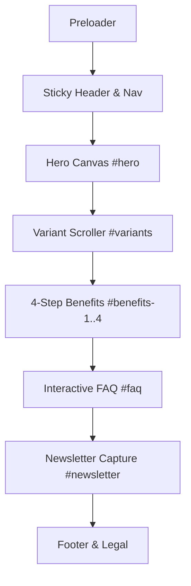

# Product Requirements Document (PRD)

**Project Name:** CAn Client – Next-Gen Beverage Experience  
**Document Version:** 1.0.0  
**Status:** Approved / Single Source of Truth  
**Target Release:** v1.0  
**Traceability:** Foundation for Prompts 1 through 8  

---

## 1. Executive Summary

**CAn Client** is a high-impact, direct-to-consumer (DTC) digital web experience engineered to showcase a premium canned beverage brand. The primary goal is to deliver an immersive, kinetic, and conversion-optimized landing page that pairs luxury editorial aesthetics with fluid, video-driven visual storytelling.

The site is built as a single-page pinned scroller comprising an asset preloader, dynamic header navigation, high-energy hero section, horizontal variant product showcase, an interactive 4-step benefits pin/toggle matrix, an accessible FAQ accordion, newsletter lead capture, and a branded footer.

### Key Success Metrics
| Metric | Baseline Target | Measurement Tool |
| :--- | :--- | :--- |
| **Largest Contentful Paint (LCP)** | < 2.2s (Mobile & Desktop) | Lighthouse / Web Vitals |
| **Interaction to Next Paint (INP)** | < 150ms | Chrome UX Report (CrUX) |
| **Cumulative Layout Shift (CLS)** | < 0.05 | Lighthouse |
| **Accessibility Standard** | WCAG 2.1 AA Compliant | Axe-Core / Lighthouse A11y (Score 95+) |
| **Conversion Rate (Newsletter / CTA)** | > 4.5% unique visitors | Custom Analytics Events |

---

## 2. Project Scope & MoSCoW Prioritization



### 2.1 MoSCoW Feature Matrix

#### Must Have (P0 - Critical Path for Launch)
- [x] Full responsive design token integration (colors, typography, spacing, pill radiuses, shadows, gradients).
- [x] Asset warming preloader with visual progress indicator and smooth page reveal.
- [x] Sticky header with dynamic backdrop blur, active section scroll-spy indicator, and responsive drawer menu.
- [x] Kinetic hero section with headline fluid typography clamp, CTA actions, and ambient brand gradient glow.
- [x] Smooth horizontal variant carousel with touch swipe, keyboard nav, and configurable product schema (supports N variants).
- [x] 4-step pinned benefits/claims showcase with synchronized video/image step transitions and active step toggling.
- [x] Fully keyboard-accessible FAQ accordion with smooth collapse/expand and ARIA attributes.
- [x] Lead capture newsletter form with email validation, loading states, success confirmation, and error boundaries.
- [x] WCAG 2.1 AA compliance across all components, contrast ratios, and keyboard focus states.

#### Should Have (P1 - High Value)
- [x] Reduced motion detection (`prefers-reduced-motion: reduce`) providing non-parallax, accessible fallbacks.
- [x] Dynamic URL hash synchronization with `window.history.replaceState` without triggering page jumps.
- [x] Offline / network recovery grace for background video playback failures.
- [x] High-fidelity SVG/Canvas placeholder fallback system when product imagery is unready.

#### Could Have (P2 - Desirable Enhancements)
- [ ] Sound design / micro-audio feedback toggle with persistent mute state.
- [ ] 3D WebGL can rotation integration on variant drag.
- [ ] Dark / Light mode toggle (if secondary theme tokens are supplied).

#### Won't Have (v1 Exclusions)
- Full e-commerce cart/checkout backend (v1 focuses on brand showcase, preorder lead capture, and retail locator).
- Multi-language i18n localization (English US only for initial release).
- User authentication and member account portal.

---

## 3. Numbered Functional Requirements (FR)

### FR-01: Asset Warming & Preloader
- **Requirement:** The system shall display an asset preloader on initial cold load, monitoring critical video headers, key fonts (`Geist`, `Franklin Gothic Atf`), and hero poster frames.
- **Traceability:** Prompt 1, Prompt 3, Prompt 6
- **MoSCoW:** MUST
- **Acceptance Criteria:**
  1. Preloader renders a numerical percentage counter (0% to 100%) and a brand mark pulse animation.
  2. The preloader dismisses with a fade-and-slide exit transition once fonts and hero assets resolve or after a 3000ms hard timeout.
  3. Preloader is executed only once per browser session via `sessionStorage` flag.

### FR-02: Sticky Header & Scroll-Spy Navigation
- **Requirement:** The system shall provide a fixed-position header that tracks the user's viewport position across all section anchors (`#hero`, `#variants`, `#benefits-1..4`, `#faq`, `#newsletter`).
- **Traceability:** Prompt 1, Prompt 4
- **MoSCoW:** MUST
- **Acceptance Criteria:**
  1. Header dynamically applies a backdrop blur (`backdrop-blur-md`) and subtle border when scrolling past 40px from page top.
  2. Active nav link highlights the corresponding section currently visible in the central 40% of the viewport.
  3. Clicking any nav anchor initiates smooth scrolling to the target element ID.
  4. On mobile viewports (< 768px), the header provides an accessible hamburger drawer with full-screen menu overlay and focus trap.

### FR-03: Kinetic Hero Section
- **Requirement:** The system shall render a hero banner featuring headline typography clamped fluidly via `--font-size-4xl: 5.242rem`, supporting dynamic background media (video loop / high-res poster) and primary/secondary CTAs.
- **Traceability:** Prompt 1, Prompt 2, Prompt 4
- **MoSCoW:** MUST
- **Acceptance Criteria:**
  1. Primary CTA button uses `--radius-lg: 34.95rem` (pill) and triggers smooth scroll to `#variants` or preorder modal.
  2. Background video plays automatically inline (`muted`, `playsinline`, `loop`) with fallback to poster image if battery saver / autoplay restrictions apply.
  3. Hero typography scales smoothly between 320px and 1920px screen widths without overflowing screen bounds.

### FR-04: Dynamic Flavor & Variant Scroller
- **Requirement:** The system shall render an interactive variant slider populated from a decoupled data schema, supporting an arbitrary count of products (default: 6 canned beverage flavors).
- **Traceability:** Prompt 1, Prompt 5
- **MoSCoW:** MUST
- **Acceptance Criteria:**
  1. Each variant card displays flavor name, badge (e.g. "Zero Sugar", "Organic"), can visual, tasting notes, and a flavor-accented background gradient.
  2. Scroller supports touch drag, mouse drag, left/right arrow click buttons, and keyboard ArrowLeft/ArrowRight navigation.
  3. Active variant selection highlights color theme accents dynamically.

### FR-05: 4-Step Interactive Benefits Pin & Toggle Matrix
- **Requirement:** The system shall present a pinned 4-stage narrative showcasing product benefits (e.g. 1: Pure Natural Ingredients, 2: 100% Recyclable Aluminum, 3: Zero Artificial Additives, 4: Functional Electrolytes).
- **Traceability:** Prompt 1, Prompt 6
- **MoSCoW:** MUST
- **Acceptance Criteria:**
  1. As the user scrolls into the section, the section container pins while steps 1 through 4 transition sequentially.
  2. Users can manually click step indicators (Tabs / Pills) to jump directly to any step.
  3. Each step transition coordinates text content, metric counters, and associated visual assets with zero jitter.
  4. Accessible via keyboard Tab and Enter/Space keys.

### FR-06: Interactive FAQ Accordion
- **Requirement:** The system shall render an expandable/collapsible FAQ section structured with semantic HTML (`<details>` / `<summary>` or ARIA-compliant accordion controls).
- **Traceability:** Prompt 1, Prompt 7
- **MoSCoW:** MUST
- **Acceptance Criteria:**
  1. Only one item expands at a time (or supports multi-expand based on user preference setting).
  2. Smooth expand/collapse height animation without layout shifts.
  3. Full screen reader support announcing expanded/collapsed state via `aria-expanded="true|false"`.

### FR-07: Lead Capture & Newsletter Subscription
- **Requirement:** The system shall provide an accessible newsletter signup component that validates email format in real-time, displays responsive submit states, and simulates asynchronous subscription.
- **Traceability:** Prompt 1, Prompt 7
- **MoSCoW:** MUST
- **Acceptance Criteria:**
  1. Rejects invalid email strings with inline field-level error messages before submission.
  2. Displays loading spinner and disables submit button during simulated or API dispatch.
  3. Displays a persistent success message with email confirmation badge upon successful completion.
  4. Emits custom event `event:newsletter_subscribed` for analytics hooks.

### FR-08: Configurable Data Schema & Placeholder Strategy
- **Requirement:** All content (variants, benefits, FAQ questions, navigation links) shall reside in typed configuration modules (`data/site-config.ts`), allowing instant addition or removal of items without template restructuring.
- **Traceability:** Prompt 1, Prompt 2, Prompt 5
- **MoSCoW:** MUST
- **Acceptance Criteria:**
  1. If product images or videos are omitted, the UI gracefully falls back to dynamic SVG can silhouettes with branded radial color gradients.
  2. Adding an 7th variant or changing benefits from 4 to 5 steps updates the UI layout without breaking grid or carousel logic.

---

## 4. Non-Functional Requirements (NFR)

### 4.1 Numeric Performance Budget

| Parameter | Budget Limit | Validation Method |
| :--- | :--- | :--- |
| **Total JavaScript Bundle (Gzipped)** | ≤ 165 KB | Next.js build bundle analyzer |
| **Total First-Load CSS (Gzipped)** | ≤ 20 KB | Production build audit |
| **First Contentful Paint (FCP)** | ≤ 1.0 s | Chrome Lighthouse 4G Fast simulation |
| **Largest Contentful Paint (LCP)** | ≤ 2.2 s | Lighthouse / WebPageTest |
| **Interaction to Next Paint (INP)** | ≤ 150 ms | CrUX / DevTools Performance Panel |
| **Cumulative Layout Shift (CLS)** | ≤ 0.05 | Layout Shift Tracker |
| **Time to First Byte (TTFB)** | ≤ 400 ms | Edge CDN deployment benchmark |
| **Frame Rate during Pin/Scroll** | Constant 60 fps (16.6ms frame budget) | Chrome DevTools Frame Meter |

### 4.2 Browser & Device Support Matrix

| Platform | Minimum Version | Verified Devices / Emulators |
| :--- | :--- | :--- |
| **Google Chrome / Chromium** | 100+ (Windows, macOS, Linux, Android) | Pixel 7/8, Samsung Galaxy S23, Desktop 4K |
| **Apple Safari** | 15.4+ (macOS, iOS, iPadOS) | iPhone 13/14/15 Pro, iPad Air, MacBook Pro |
| **Mozilla Firefox** | 100+ (Windows, macOS) | Desktop 1080p, 1440p |
| **Microsoft Edge** | 100+ (Windows, macOS) | Surface Pro, Windows 11 Desktop |

### 4.3 Accessibility Standards (WCAG 2.1 AA Compliance)
1. **Color Contrast:** All body text maintains a minimum contrast ratio of 4.5:1 against background colors; large headings (18pt / 24px bold+) maintain at least 3.0:1.
2. **Keyboard Traversal:** All interactive controls (buttons, links, accordion summaries, scroller controls) are reachable and operable via `Tab`, `Shift+Tab`, `Enter`, and `Space`.
3. **Visible Focus Rings:** Every interactive element has an explicit high-contrast 2px focus ring (`focus-visible:ring-2 ring-offset-2`).
4. **Motion Safety:** All animations respect `@media (prefers-reduced-motion: reduce)`, immediately disabling scroll-pin scrubbing and parallax shifts.
5. **Screen Readers:** ARIA landmarks (`<header>`, `<main>`, `<nav>`, `<footer>`, `<section>`) and labels (`aria-label`, `aria-expanded`, `aria-controls`) applied across all components.

### 4.4 Search Engine Optimization (SEO) & Social Graph
1. Semantic single `<h1>` on page with logical `<h2>` and `<h3>` heading hierarchy.
2. Automated meta tags: Title, Meta Description, Canonical URL, OpenGraph Image (1200x630px), Twitter Card (`summary_large_image`).
3. Schema.org JSON-LD Structured Data: `Product`, `Brand`, `Organization`, and `FAQPage`.
4. Automated robots.txt and sitemap.xml endpoints.

---

## 5. Data Contracts & Content Schemas

### 5.1 Variant / Flavor Item Schema
```typescript
export interface ProductVariant {
  id: string;
  name: string;
  tagline: string;
  flavorProfile: string;
  accentColor: string; // Hex or CSS variable reference
  glowGradient: string;
  canImage: string; // URL or local asset path
  nutritionHighlights: Array<{ label: string; value: string }>;
  badge?: string; // e.g. "Best Seller", "Limited Edition"
  inStock: boolean;
  ctaLink: string;
}
```

### 5.2 Benefit Step Schema
```typescript
export interface BenefitStep {
  stepNumber: number; // 1..N
  id: string;
  title: string;
  subtitle: string;
  description: string;
  metric?: { value: string; label: string };
  mediaUrl: string;
  mediaType: "video" | "image";
  posterUrl?: string;
}
```

### 5.3 FAQ Item Schema
```typescript
export interface FAQItem {
  id: string;
  question: string;
  answer: string;
  category: "Ingredients" | "Shipping" | "Sustainability" | "Orders";
}
```

---

## 6. Traceability Matrix

| Requirement | PRD Section | Downstream Prompt ID | Verification Test |
| :--- | :--- | :--- | :--- |
| Design Tokens & CSS Variables | Section 4.3, 5.1 | Prompt 2 | Design System Reference Route check |
| Preloader & Asset Warming | FR-01 | Prompt 3 | Network throttling simulation & timeout audit |
| Sticky Header & Scroll-Spy | FR-02 | Prompt 4 | Scroll anchor sync test |
| Hero Section & Fluid Typography | FR-03 | Prompt 4 | Responsive viewport resize audit |
| Horizontal Variant Scroller | FR-04 | Prompt 5 | Touch drag & keyboard navigation test |
| 4-Step Benefits Scroller | FR-05 | Prompt 6 | Pinning & Step tab toggle test |
| FAQ Accordion & Newsletter | FR-06, FR-07 | Prompt 7 | Form validation & ARIA state checks |
| Optimization & Performance | Section 4.1 | Prompt 8 | Lighthouse 95+ score validation |
