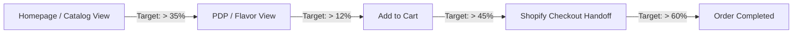

# Hayati World — Post-Launch Monitoring & Observability Plan
## Prompt 28 Deliverable · Technical & Conversion Health Surveillance

> **Primary Objective:** Catch motion, performance, checkout, or SEO regressions within minutes of go-live.

---

## 1. Technical Health & Core Web Vitals (CWV)

Monitor live telemetry across desktop and mobile devices via Vercel Speed Insights / Google Search Console:

| Metric | Target Budget | Warning Threshold | Critical Alert | Action Protocol |
|---|---|---|---|---|
| **LCP (Largest Contentful Paint)** | `< 2.0s` | `2.5s` | `> 3.5s` | Audit `HAYATI.webp` CDN cache headers and priority attribute |
| **CLS (Cumulative Layout Shift)** | `< 0.05` | `0.08` | `> 0.10` | Check aspect-ratio on Hero canvas or VariantScroller pinned cards |
| **INP (Interaction to Next Paint)** | `< 150ms` | `200ms` | `> 300ms` | Profile GSAP ticker RAF load during horizontal scroll |
| **TTFB (Time to First Byte)** | `< 100ms` | `200ms` | `> 500ms` | Verify Edge Middleware routing & Vercel CDN cache hit ratio |
| **5xx Server Error Rate** | `< 0.01%` | `0.05%` | `> 0.20%` | Inspect Next.js App Router server logs |

---

## 2. E-Commerce Conversion Funnel Surveillance

Monitor commerce events in Shopify Analytics and Google Analytics 4 (GA4):

### Funnel Health Indicators:
1. **Add-to-Cart Drop-off:** If Add-to-Cart rate drops by > 20% compared to legacy baseline, immediately verify `useCartStore` local state on mobile Safari / Chrome.
2. **Checkout Handoff Drop-off:** If Cart-to-Checkout clicks fail, inspect Shopify cart permalink generation (`/cart/{variant_id}:{qty}`).
3. **Out-of-Stock False Positives:** Verify `inStock` flags in `content.json` match real inventory quantities in Shopify Admin.

---

## 3. SEO & Redirect Monitoring (Weeks 1 – 4)

1. **Google Search Console 404 Crawl Errors:**
   - Review Coverage / Indexing reports daily for the first 14 days.
   - Any unmapped Shopify URL throwing 404 must be appended to `next.config.mjs` redirects within 2 hours.
2. **Canonical URL Indexation:**
   - Confirm Google is indexing `https://hayatiworld.com/products/[slug]` rather than old query-parameter URLs.
3. **Structured Data Validation:**
   - Run Google Rich Results Test weekly on all 16 PDPs to verify Offer (INR) and Product schema remain valid.

---

## 4. Incident Escalation & Response SLA

| Severity | Definition | Response SLA | Resolution SLA |
|---|---|---|---|
| **P1 - Critical** | Cart / Checkout broken; 5xx errors on homepage; complete site outage | `< 15 mins` | `< 1 hour` (Rollback if > 45m) |
| **P2 - High** | Variant switcher broken on specific mobile browser; 404 on high-traffic legacy URL | `< 1 hour` | `< 4 hours` |
| **P3 - Medium** | Animation stutter on low-end mobile; minor copy error on legal page | `< 4 hours` | `< 24 hours` |
| **P4 - Low** | SEO tweak, non-critical badge alignment | Next sprint | Next scheduled deploy |
