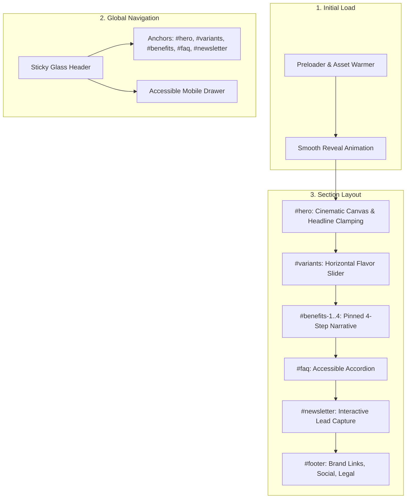

# Sitemap & Information Architecture

**Project:** CAn Client – Direct-to-Consumer Canned Beverage Experience  
**Architecture Type:** High-Performance Single-Page Pin / Scroll Application  
**Primary Anchors:** `#hero`, `#variants`, `#benefits-1`, `#benefits-2`, `#benefits-3`, `#benefits-4`, `#faq`, `#newsletter`  

---

## 1. Page Flow & Structural Overview

---

## 2. Comprehensive Section Inventory

| Index | Section Name | DOM Anchor ID | Primary Components & Visuals | Data Source / Schema | Interactivity & State Behavior | ARIA Landmark / Role |
| :---: | :--- | :--- | :--- | :--- | :--- | :--- |
| **00** | **Preloader** | `id="preloader"` | Brand monogram, circular progress ring, numeric % readout | Static asset loader + font readiness probe | Fades to `opacity: 0, pointer-events: none` on resolution; bypass on repeat visits | `role="status"` `aria-live="polite"` |
| **01** | **Global Header** | `id="header"` | Logo wordmark, Desktop Nav links, CTA Pill button, Mobile toggle | `siteConfig.navigation` | Glassmorphism on scroll (>40px), Active link highlight via IntersectionObserver | `<header>` `<nav role="navigation">` |
| **02** | **Hero Section** | `id="hero"` | Giant fluid headline, background loop video / fallback canvas, CTAs, Hero glow gradient (`--gradient-brand-1`) | `siteConfig.hero` | Parallax floating can elements, button hover magnetic micro-interaction | `<section id="hero">` `<main>` entry |
| **03** | **Variant Scroller** | `id="variants"` | Horizontal multi-card track, Flavor badge, Dynamic gradient aura, Can silhouette, Nutrition pill tag | `siteConfig.variants` (N items) | Touch swipe, drag scroll, left/right keyboard arrows, hover card lift | `<section id="variants" aria-roledescription="carousel">` |
| **04** | **4-Step Benefits** | `id="benefits"` / `#benefits-1..4` | Pinned canvas, Stage step pill indicators (1..4), Video/Image sync viewport, Stat counter badge | `siteConfig.benefits` (4 steps) | Pinned scroll container; click step pills to trigger smooth jump/scrub | `<section id="benefits" aria-label="Product Benefits">` |
| **05** | **FAQ Accordion** | `id="faq"` | Category filter tags, expandable question cards, animated chevron indicator | `siteConfig.faqs` | Single or multi-item expand, full keyboard navigation (Tab/Enter/Space) | `<section id="faq">` `
` or `role="region"` |
| **06** | **Newsletter** | `id="newsletter"` | Split layout with brand tagline, email input field, submit CTA pill, validation badge | Client state / Newsletter API stub | Live regex validation, pending spinner, instant green success badge | `<section id="newsletter">` `<form>` |
| **07** | **Footer** | `id="footer"` | Giant brand footer stamp, social links, privacy policy, terms, copyright | `siteConfig.footer` | Hover underline animations, external link `rel="noopener noreferrer"` | `<footer>` |

---

## 3. Anchor & Deep-Linking Specifications

1. **`#hero`**: Scrolls to `top: 0px`. Sets active navigation link to "Home".
2. **`#variants`**: Scrolls to the top offset of the flavor carousel (accounting for header height of `72px`).
3. **`#benefits`**: Jumps to the start of the pinned benefits section.
4. **`#benefits-1` through `#benefits-4`**: Deep-links directly to the corresponding benefit slide and synchronizes the active step state tab.
5. **`#faq`**: Smooth scrolls into the FAQ viewport.
6. **`#newsletter`**: Smooth scrolls directly to the input capture box and focuses the email field when clicked from header CTA.

---

## 4. URL History State Contract

- When scrolling between sections, an `IntersectionObserver` updates `window.history.replaceState(null, '', '#section-id')` when a section occupies ≥ 50% of the viewport.
- Hash changes do **not** trigger page reloads or layout jump disruptions.
- Back and Forward browser buttons smoothly navigate across anchors without full-page re-renders.
